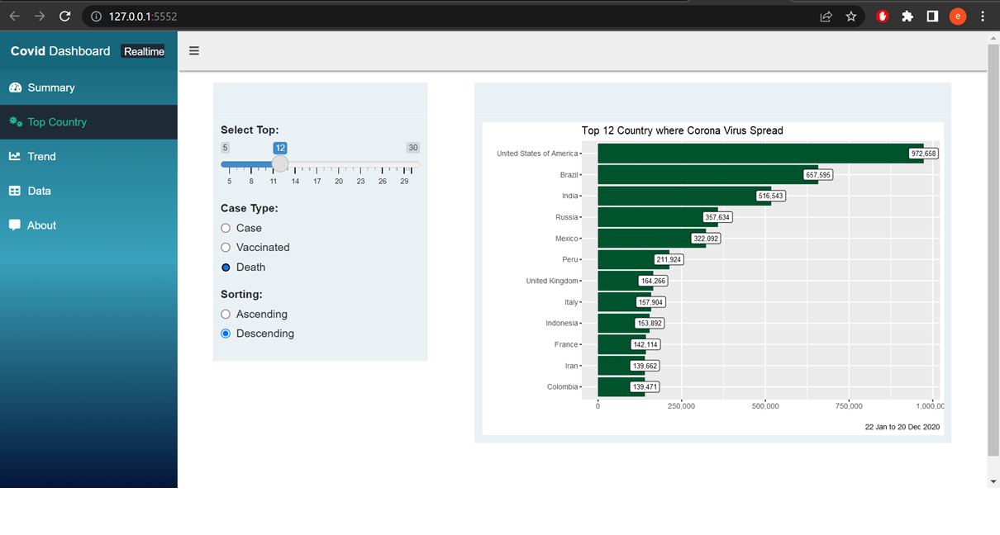
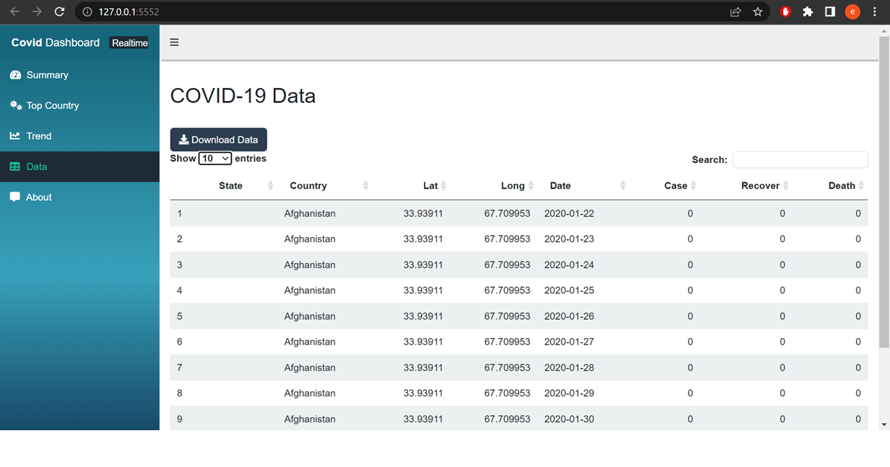
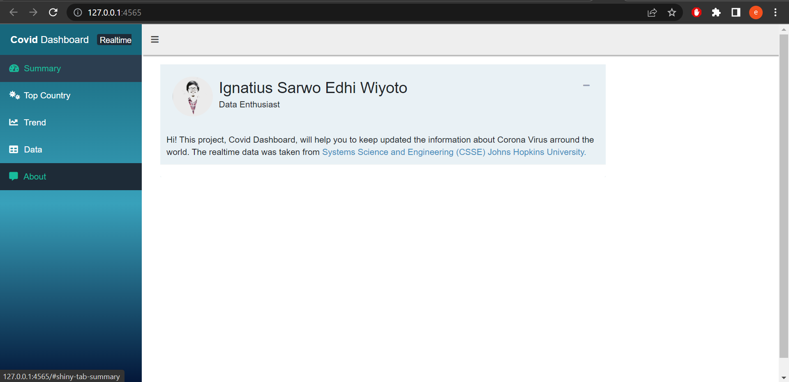

# Realtime-Covid-Dashboard

Hi! This project, Covid Dashboard, will help you to keep updated the information about Corona Virus arround the world.
The realtime data was taken from, [`Systems Science and Engineering (CSSE) Johns Hopkins University.`](https://github.com/CSSEGISandData/COVID-19/)
                               

